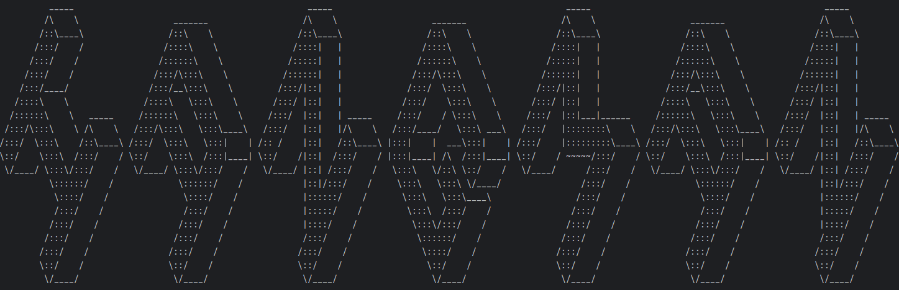
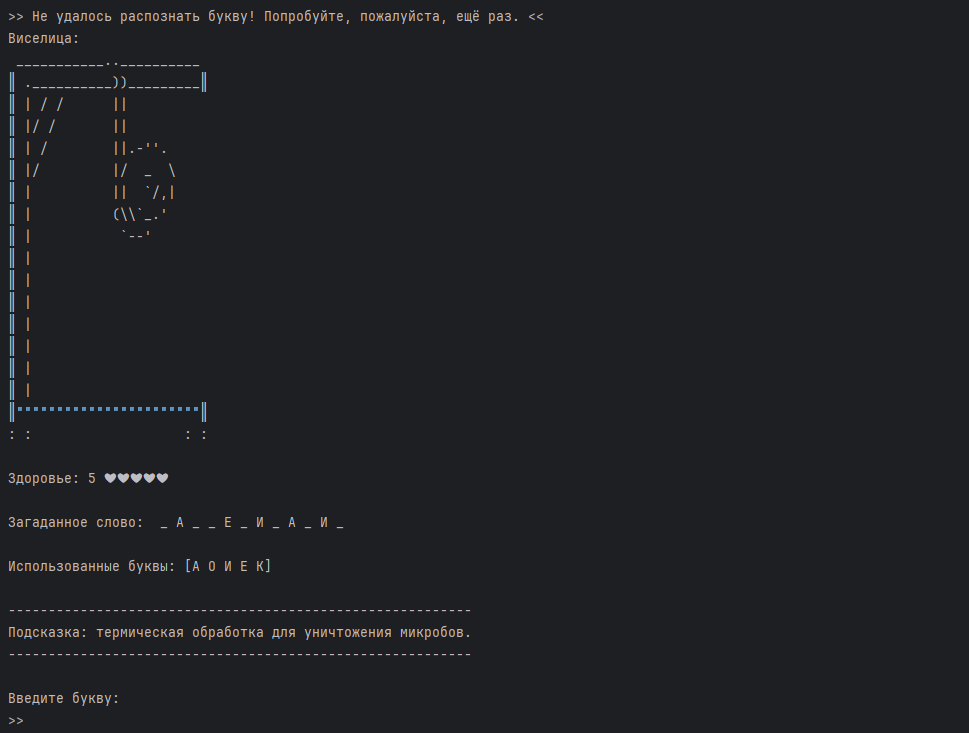
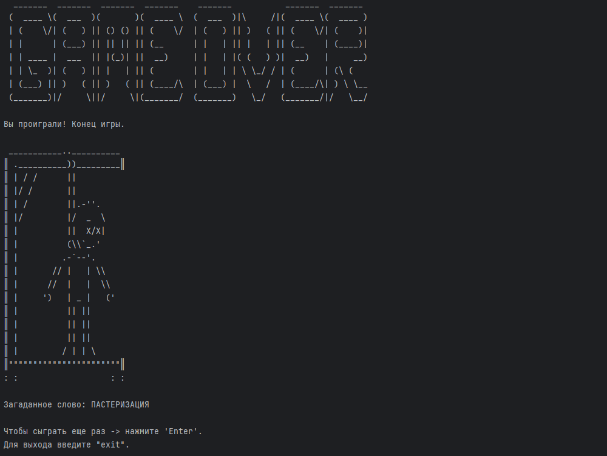

> **ВАЖНО:** Для корректного отображения игры рекомендуется развернуть окно консоли на весь экран.

# HANGMAN - Игра "Виселица"

Классическая игра "Виселица" с современными улучшениями, реализованная как консольное приложение (CLI) на Kotlin.

### Особенности реализации
- **5 тематических категорий слов**: животные, еда, природа, хобби, одежда
- **3 уровня сложности**: легкий, средний, сложный (на основе длины слов)
- **Система подсказок**: описание загаданного слова для помощи игроку
- **Два режима работы**: интерактивный и неинтерактивный (тестовый) режимы

### Визуальные улучшения
- **ASCII Art**
- **Система здоровья**: интуитивно понятное отображение жизней в виде сердечек ❤
- **Очистка экрана между переходами**: предыдущие экраны не накладываются друг на друга

### Дополнительный материал:

